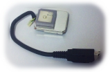
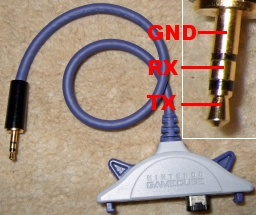
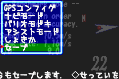

# ParaNavi
GPS flight navigation software for paragliding competitions

(Retrieved from Yahoo! GeoCities archives 2005)

For more details, please refer <https://rinos.hateblo.jp/entry/paranavi_first.html>

## What to prepare
(automatic translation)
### Garmin GPS, or a GPS capable NMEA output device
A GPS unit is required. I   have confirmed that it works with eTrex Legend ,  Foretrex 101 ,  M-241 (Bluetooth) ,  GPS-52D , and  GT-720F .

[Note 1 ] When using a NMEA device, it must be able to output NMEA-0183 GGA/ RMC sentences and the output baud rate must be one of 9600/38400/57600/115200 bps . ( When using Bluetooth GPS , it can operate at any baud rate.)

[Note 2 ] When using an NMEA device, the rate of climb (vertical speed) is calculated by the paranavigator, but the accuracy of the vario tends to be lower than that of a Garmin binary output device that can directly obtain the rate of climb . (In particular, when there are few satellites to capture, the rate of climb becomes unstable when the satellite is switched.) For this reason, if you want accuracy in vario or L/D, Garmin seems to be a better choice.

[Note 3] The GPS -52D is an embedded module, but it is large (26x31x10mm) so it seems difficult to install it inside the GBA . I modified a pedometer from Daiso to make it external.

  

If you power the GPS -52D from the GBA , you won't need a battery for the GPS , but the GBA 's operating time will be about 8 hours, which is about 1/3 of when the GPS -52D is not connected. If you care about operating time , it's better to use a normal GPS .

[Note 4] The attached specifications for the GT-720F state that it should be powered from 3.8V-8V, but it seems that it can also run on the GBA 's VDD (3.5V). Also, according to the specifications, pins 5 and 6 of the NC are TTL -IN and TTL -OUT, so simply connecting these to the GBA 's SO and SI (plus VDD and GND for a total of four) will get the navigation system working. This GPS is also a modular type, so I'm using it in a security alarm case (left photo) that I got from a 100-yen shop.

Although it consumes more current than the GPS -52D, the reception sensitivity is very high, making it just right for a 3-4 hour flight.
 

### Game Boy Advance ( GBA )
GBAs are widely available second-hand and can be purchased cheaply. They also  work with the GBA 's successor  , the GBA SP . The GBA SP is more expensive than the GBA , but if you want to check the logs recorded at dusk, the GBA SP with its light is easier to see. The GBA SP can also be folded, so it has the advantage of protecting the LCD when carrying it around . The disadvantage of the GBA SP is that the earphone jack is a dedicated connector, so you cannot use a regular 3.5mm plug. Also, this connector is blocked when the GC - GBA connection cable is attached, so if you want to connect to a GPS with the GC - GBA connection cable and also use earphones, you will need to modify it for earphones.

The software will also  work with NDS , but since NDS does not have an expansion connector for communications , it will be necessary to modify the device in order to connect it to a GPS via cable.

Nintendo has announced a new model called GAMEBOY micro (tentative name), which has a sturdy metal body, is slightly smaller and lighter than eTrex, and is perfect for navigation. You should be able to use this device without any problems. ⇒It has been confirmed to work with a device that was given to us for debugging purposes after its release . (Note that the connector is for micro only)

### GBA - GPS cable
The simplified circuit using 74HC04 is shown below. (Please modify the cable at your own risk...)

[Caution] It seems that
some recent new GPS (shipped after the second half of 2006?) cannot communicate unless a negative voltage is input to RxD. If you are using such a GPS , please create a cable using a level converter.

 

### Example GC - GBA connection cable
If you use a chip resistor, you can mount it on one side with simple wiring. In this case, it is easier to work with it if you turn the IC over and attach the IC and resistor to the board with double-sided tape. If you keep the end of the resistor in contact with the IC pin , soldering will be easier.

 

 

## How to see the navigation screen
### Standard Horizontal

The red arrow points to the next pylon, and the white arrow points to the pylon two pylons away . The length of the pylon When the expected arrival altitude is below pylon the arrow touches the outer circle when the expected arrival altitude is above pylon

### Standard Vertical

At the final pylon , the goal position is displayed as a semicircle. The positioning status at the center of the circle changes as follows: ◎ (Excellent) → ○ (3D) → □ (2D) → × (Satellite lost) → Flashing × (Communication error).

### Simple Horizontal

The display content of the pylon a list of the initials of the pylon

### Simple vertical

The variometer on the left side of the screen will invert from the center when it exceeds ±5m/s. The sample is -8m/s.

### 3D Horizontal

Standard mode uses a horizontal view of the pylons shows them pylon is displayed as a green circle, and the pylon two steps ahead is displayed as a blue square. You can reach the target by gliding so that the target is in the center of the circle.

### 3D Vertical

When the target moves out of the circle, an arrow indicates the direction and distance to the pylon

### 2 x pylons Horizontal

In this mode, information on two pylons up to two pylons ahead is always displayed. The distance to the two pylons are calculated from the distance via the next pylon

### 2 pylons vertical

The display content of the predicted arrival altitude field can be changed in the settings. (Choose from four options: predicted arrival altitude (a), difference between predicted arrival altitude and pylon pylon altitude (d), difference between predicted goal arrival altitude and goal altitude (g). The predicted arrival altitude field in the sample image shows the difference between
the predicted arrival altitude and pylon altitude.

### Wind Horizontal

Connecting an anemometer will give you information on air speed.

### Wind vertical

The units of air speed and ground speed display can be changed in the [Config] menu.

### Trajectory display (automatic switching)

When you center the camera, it automatically switches to track mode. The track is color-coded by the rate of ascent. Before the goal, the predicted goal arrival altitude difference [m] is displayed in the [Acceleration] field.

### Cylinder map (automatic switching)

When approaching a pylon will show the route from the previous pylon will show the route to the next pylon

## How to use the setting menu
### Main Menu

Press the A button to display the menu. Basically, you use the cursor buttons to select, the A button to confirm, and the B button to cancel.

### Flight Log

You can check the flight status from [Flight Log] in the [Info] menu. You can clear the flight log by pressing the START button on the flight log screen. For details, please refer to "Flight Log Display Contents" below.

### Task Log

You can check the task status from [Task Log] in the [Information] menu. You can clear the task log by pressing the START button on the task log screen.

### GPS unit information

You can check the communication status from [GPS unit] in the [Information] menu. If there are many communication errors, please check the cable.

### Graph display

You can check the current flight status in a graph by selecting [Graph] from the [Information] menu. Use the up and down cursor keys to switch the displayed content, and the left and right cursor keys to set the display range.

### Task Menu

Set the task. When the task type is "Free Flight", pressing the cursor button will switch to Goto mode for nearby waypoints. (UP: Go to the nearest WPT, Left: Go to the closest WPT, Right: Go to the furthest WPT, Down: Return to free flight mode)

### Route Menu

Routes can be downloaded from the GPS or created manually. A route consists of 1 to 99 waypoints. Up to 20 routes can be registered.

### Route Creation

When creating a route manually, you must register waypoints before creating the route. Select one or more registered waypoints to create a list, give it a name, and make it into a route.

### Waypoint Menu

Waypoints can be created manually or downloaded from the GPS , just like routes. Up to 1000 waypoints can be registered.

### Waypoint Change

In older GPS models , the downloaded waypoint may not have altitude information. In that case, please enter the altitude from [Change] in the [Waypoint] menu.

### Config

From the [Config] menu, you can configure various settings. If you are using a cartridge, you can save settings and route information to the cartridge.

### How to enter a name

When entering a name for a route or waypoint, use the cursor buttons to select characters, the A button to add characters, the B button to delete characters, and the L/R buttons to move the caret.

## How to use the Flight log

### 
【#1 Summary】

Speed ​​Avg : Average ground speed [km/h]
Speed ​​Max: Maximum ground speed [km/h]
Lift Max: Maximum rate of lift [m/s]
Sink Max: Maximum descent rate [m/s]
Alt. Max: Maximum altitude [m]
Accel. Max: Maximum acceleration [G]
Accel. Min: Minimum acceleration [G]

【#2 Distance】

Trip meter: Accumulated distance traveled since the start of flight log collection [m]
Sect meter: Accumulated distance traveled from the previous pylon
Total gain: Cumulative altitude gained [m]

【#3 Motion statistics】

Pitching: Number of pitches [times] (excluding centering)
C-Pitching: Number of pitches [times] (during centering)
Rolling: Number of rollings [times]
Centering: Number of centering rotations [laps]
Spiral: Number of spiral rotations [laps]
Stall: Stall time [sec]

【#4 Status statistics】

Straight: Time to go straight [sec]
Left turn:　  Left turn time [sec]
Right turn: Right turn time [sec]
H Stop: (horizontal) stop time [seconds]
Pre flight: Waiting time [sec]

【#5 Duration】

Takeoff time: Takeoff time
Flight time: Time elapsed since takeoff [seconds]
Boot time: Operating time from when the navigation system was turned on to the present [seconds]
Resume time: The time since the navigation system

[#6 Soaring statistics summary]

Lift: Lift time [sec]
LvKeep: Horizontal flight time [seconds]
Sink: Fall time [sec]

The default range of LvKeep is set to ±0.1m/s. The range can be changed from [Config]-[Assist]-[Parameter 2]-[Level Keep].

### 

【#7 Soaring statistics: (Lift)】

Centering: Centering rise time [sec], ratio [%]
Turn: Turn time [sec], ratio [%]
Straight: Climb time in straight flight [sec], ratio [%]
H Stop: Vertical rise time [sec], ratio [%]
Total: Total ascent time [sec]

[#8 Soaring statistics: (LvKeep)]

Centering: Centering horizontal flight time [sec], ratio [%]
Turn: Time in horizontal flight during a turn [sec], ratio [%]
Straight: Time in horizontal flight during straight flight [sec], ratio [%]
H Stop: Stop time [seconds], ratio [%]
Total: Total horizontal flight time [sec]

[#9 Soaring statistics: (Sink)]

Centering: Centering fall time [sec], ratio [%]
Turn: Time to descend by turning [sec], ratio [%]
Straight: Descent time in straight flight [sec], ratio [%]
H Stop: Vertical descent time [sec], ratio [%]
Total: Total descent time [sec]

【#10 Soaring statistics: (Gain)】

Centering: Height gained by centering [m], ratio [%]
Turn: Height gained by turning [m], ratio [%]
Straight: Altitude gained during straight flight [m], ratio [%]
H Stop: Vertical gain [m], ratio [%]
Total: Total altitude gained [m]

【#11 Soaring statistics: (Loss)】

Centering: Height loss due to centering [m], ratio [%]
Turn: Height loss due to turning [m], ratio [%]
Straight: Altitude loss during straight flight [m], ratio [%]
H Stop: Vertical altitude loss [m], ratio [%]
Total: Total altitude loss [m]

【#12 Soaring statistics: (Vario)】

Centering: Average rate of ascent during centering [m/s]
Turn: Average rate of climb during a turn [m/s]
Straight: Average rate of climb when flying straight [m/s]
H Stop: Average rate of rise when stopped horizontally [m/s]
Total: Average ascent rate [m/s]

【#13 Centering statistics】

Time: Centering time [sec]
Balance: Left/right centering time ratio [%]
Count: Number of centerings [times]
Turn: Number of centering turns [laps]

(In the Centering statistics from #13 to #16, logs are displayed separately for left and right centering.)

【#14 Centering statistics :(Vario)】

vMax: Maximum rate of ascent [m/s]
vMin: Maximum descent rate [m/s]
vAvg: Average rate of ascent [m/s]
Gain: Accumulative altitude gain [m]
Loss: Accumulated altitude loss [m]

【#15 Centering statistics :(Power)】

Spd .: Average speed [km/h]
　Max: Maximum speed [km/h]
Gr.: Average acceleration [G]
　Max: Maximum acceleration [G]

【#16 Centering statistics :(etc)】

RPM : Average rotational speed [revolutions per minute]
r.: mean centering radius [m]
Dr/C: Average duration of one centering [sec]
Tr/C: Average number of turns per centering [laps]

【#17 Alt. histogram】

Altitude histogram (50 divisions)

(The display range of histograms #17 to #20 is automatically adjusted according to the data.)

【#18 Vario. histogram】

Vario histogram (25 divisions x 2)

【#19 Speed ​​histogram】

Speed ​​histogram (50 divisions)

【#20 Direction histogram】

Direction histogram (24 divisions)

### Enjoy!

　

usage: https://rinos.hateblo.jp/entry/paranavi_first.html
